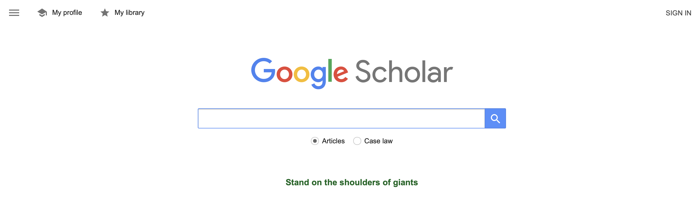

#  How do we do scholarly research?
- We learn the language, the vocabulary around the question
- We understand who the key figures are in that research
- We identify the kinds of evidence in that research
- We attempt to understand the weight of the evidene
- We make connections with what we know (creativity)
- We attempt to identify the open questions (creativity)


#  List some questions in the domain of behavioural science that you want to know the answer to.
    -   Example: Does caffeine make people smarter?

    -   Come up with your own questions.

## Task two (understanding what it means to be a scholar)

For any given question, your first thought should be to go to the literature. You want to know "What's the weight of the evidence?" This will help you think about the problem, talk intelligently about the problem, and communicate your ideas more clearly both in speech and writing. This is *power*.

If you want to know a field better than many experts, a) read 100 relevent abstracts on a topic, b) identify the key articles, c) read the key articles in entirety, and d) summarize what you find and think in writing. Today we'll focus on doing both of these steps in the most efficient way possible.

### Surfing Science (with Google Scholar -- 8 key steps)

1.  First, get a gmail account so you can archive what you find on Google Scholar

2.  Enter keywords into GS

    

-   You don't have to find the answer---don't assume you even know how to define your question---you have to find something that will tell you how to search for what you want to find out.
-   The answer isn't in one article. It is *always* the *weight of the evidence*. So you have to find the evidence.
-   Do that by finding something close. You can read the abstract to see if it's about the right topic.
-   Then read a little of the intro to find what articles it cites that are *central to the field*
-   Then go to those articles to see if they are indeed key sources.
-   Identify and write down *keywords* that you read as you go, so you can narrow your search using the language, vocabulary, and concepts that are critical to the field.

3.  Identify the iconic papers.

4.  Search more recent literature by looking at citations that cite the iconic work.

    

5.  Use libraries to store key articles by adding them to your library.

    

6.  Used advanced search to narrow the search to particular journals, authors, years, etc.

    

7.  Click 'related articles' to find similar articles


8.  Once you have your sources, you can download a bibliography from your library for easy citation in Rmarkdown or Latex. To import this into Rstudio for easy citations in any format, use the bibtex format.

    

9. Write down thoughts and research questions that come to mind as you do your research.

# Writing with RMarkdown

0. Writing is absolutely essential to clear thinking.  You should write whenever you read, to summarize your ideas and *more importantly* to develop new ideas and research questions. Productive researchers write daily. 

1.  You'll need R and Rstudio (which you can find online, but this link should help): <https://rstudio-education.github.io/hopr/starting.html>

2.  Once you have both installed, install these libraries

```{r}
# install.packages('tinytex')
```

3.  Go to File \> New File \> R Markdown

-   give your document a title, an author, and choose pdf as output

4.  Once your file is started, you can click on 'Visual' just above the text to get a visual WYSIWYG format.

5.  Add a line in the YAML at the top:\

-   bibliography: your_bib_file_name.bib
-   Make sure this file is in the same directory as your markdown file, or tell the file where to find it.

5.  Now to add a citation by typing [@ and R will identify your bib library and offer suggestions based on what you type. Press return to add it. So if I want to add a citation to some work I know, I can type [@Walsh:1996wj], and it will show up in the references below.

# Additional Resources

-   Visual Markdown Mode for Rstudio: <https://inbo.github.io/tutorials/tutorials/r_citations_markdown/>

-   More on Visual Markdown: <https://www.rstudio.com/blog/exploring-rstudio-visual-markdown-editor/#:~:text=To%20switch%20into%20the%20visual,side%20of%20the%20editor%20toolbar.>

-   Winning hacks for Google Scholar: <https://www.editage.com/insights/8-winning-hacks-to-use-google-scholar-for-your-research-paper>

-   Downloading your .bib file: <https://gradschoolreadingroom.blogspot.com/2017/12/you-can-now-export-multiple-citations.html>

-   Rstudio quick guide to citations and styling: <https://www.youtube.com/watch?v=zuuOYjE8m98>

# Things to do to keep you up to date

## Follow Journals -- get updates with new publications
- APS Journals: https://journals.sagepub.com/aps
- PNAS
- Nature
- Nature Human Behaviour
- Science

# Iconic books

- Freakonomics, Dunbar and Levitt
- Life 3.0 [[Problems in AI]], Tegmark
- The AI Delusion [[Bullet holes in returning planes]], Smith
- Signal and the Noise, Silver
- Weapons of Math Destruction, O'Rourke
- Thinking Fast and Slow, Kahneman

# Test line

# References
